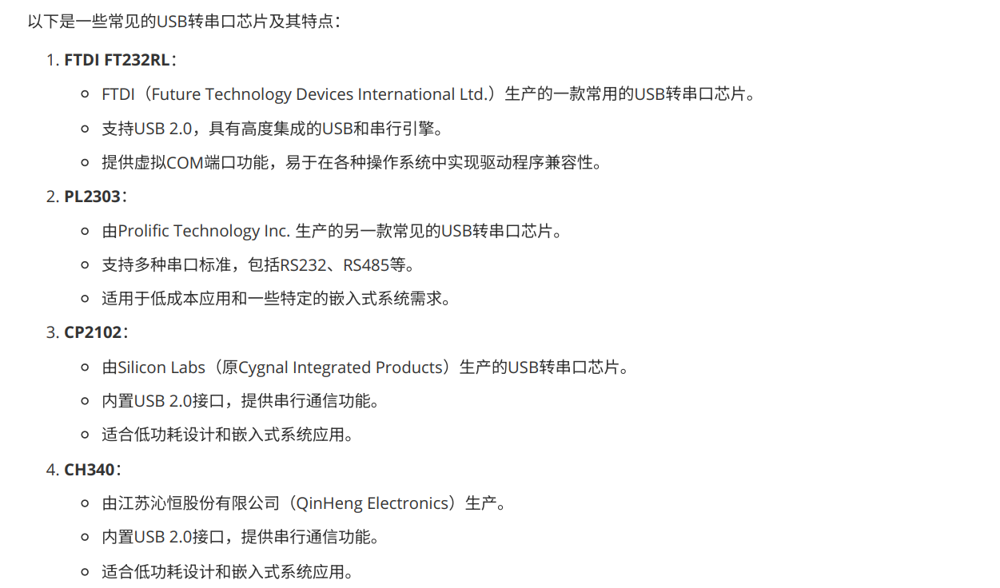
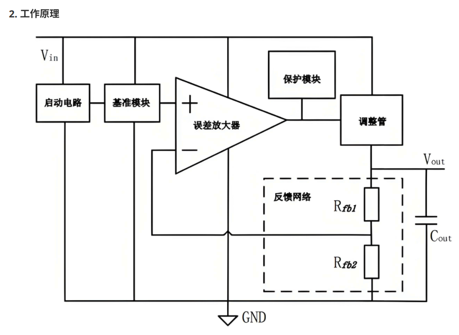
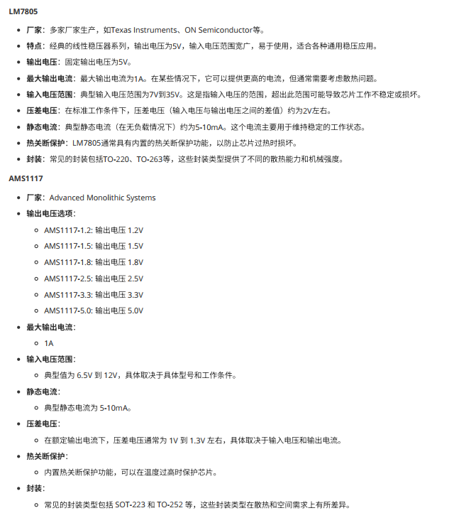
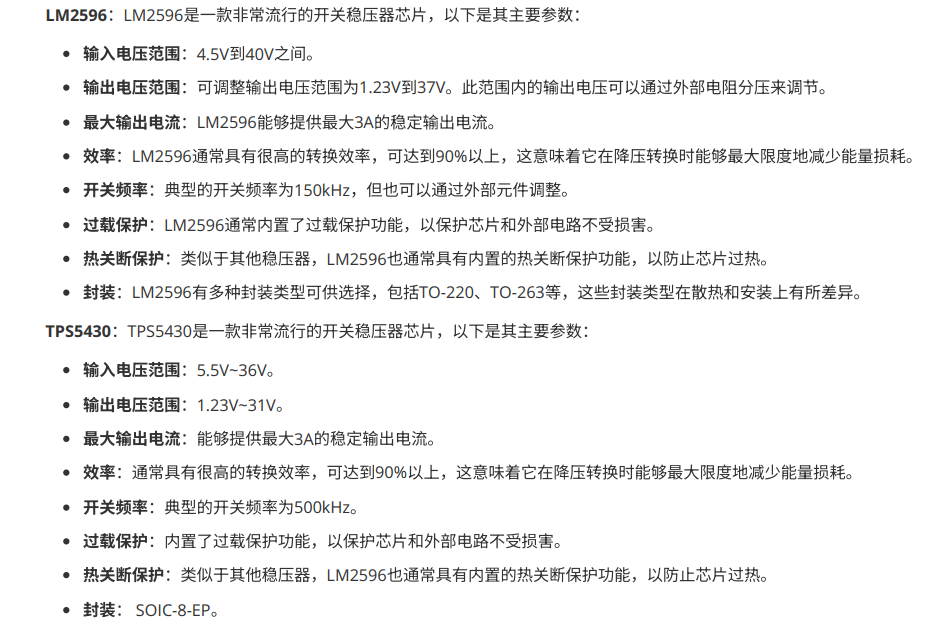
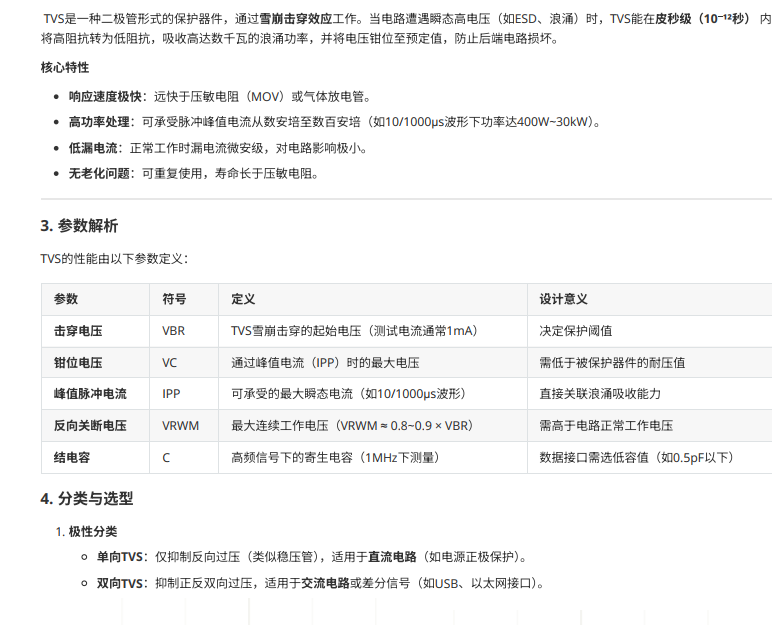

## 4.1 蜂鸣器
### 有源蜂鸣器（内部驱动--振荡器）
### 无源蜂鸣器（外面驱动--2k-5k方波）
---

## 4.2 光耦隔离器
### 利用光信号在输入和输出之间进行耦合和隔离，实现电气隔离
---

## 4.3 继电器
### 小电流控制大电流
--

## 4.4 晶振
### 集体振荡器 产生稳定信号
### 晶振工作频率
#### **32.768KHz** RTC和低功耗
#### **4MHz/8MHz/16MHz** 微控制器和数字电路
#### **100MHz/200MHz** 高速通讯
### 种类
#### 有源晶振 
##### 更高的输出功率和较低的输出阻抗，适用于驱动较重负载和信号传输距离较长的场合
##### 电路中使用放大器提供正反馈放大，需要外部电源供电
#### 无源晶振
##### 更简单、节省能源，适用于低功耗、简单的电路设计
##### 依靠晶体的压电效应产生振荡信号，不需要外部供电
---

## 4.5 USB转串口芯片

## 4.5 电源芯片（LDO）
### LDO是低压差线性稳压器 适用于输入和输出电压之间保持较小差值

#### 低压降 通常在几百毫伏到几伏
#### 稳定性 不需要外部电感
#### 设计简单
#### 低噪声

---

## 4.7 电源芯片（DCDC）
### 将一种形式的直流电压转换成另一种不同的直流电压
### 类型
#### **降压转换器（Buck）**
#### **升压转换器（Boost）**
#### **降压-升压转换器（Buck-Boost）**
#### **反向转换器（Inverting）**

---

## 4.8 静电保护芯片
### TVS（瞬时电压抑制器）保护电子电路受瞬态过电压 快速响应和高能量吸收功能，将异常电压限制在安全范围

