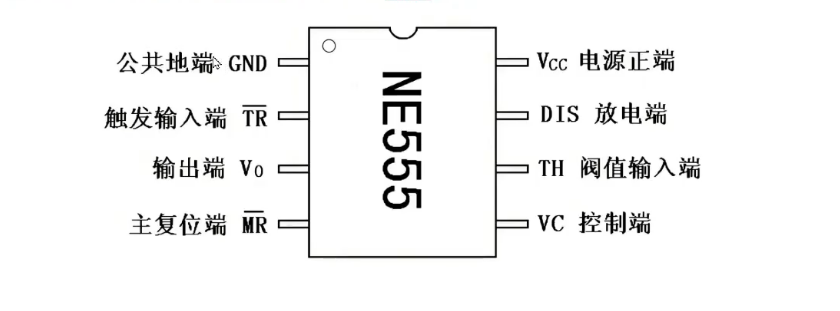
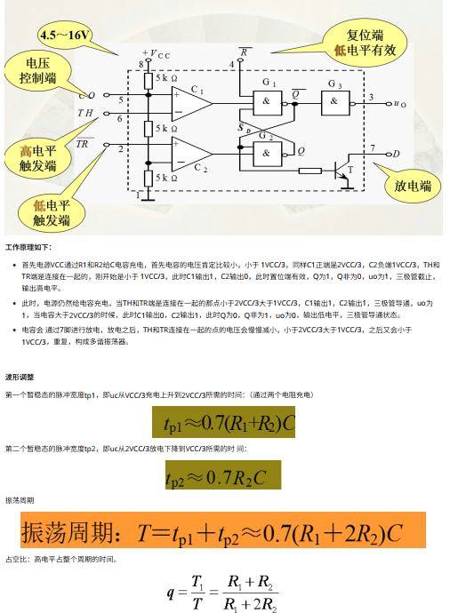

## 3.1 门电路
### 与门 全1为1
### 或门 有1为1
### 非门 取反
### 异或门 相同为0 不同为1
## 3.2 施密特触发器（滞回比较器）电路
### 触发器--输出保证其值，直到输入变化能够触发变化
### 施密特触发器--逻辑输入，将提供滞后两个阈值电平：高和低；减少噪声信号产生的误差，从而产生方波；将三角波和正选波等其他类型信号转换成方波
### 施密特触发器工作原理
#### UTP
#### LTP
#### 滞后可以定义为当输⼊⾼于某个选定阈值 (UTP) 时，输出为低。当输⼊低于阈值 (LTP) 时，输出为⾼；当输⼊介于两者之间时，输出保持其当前值。这种双重阈值动作称为滞后
### 用途
#### 开关去抖
#### 振荡器
---

## 3.3 555定时器
### 三极管+电阻+电容 精确实现延时功能

### 无稳态电路（多谐振动器）

---

## 3.4 ADC转换器
### 模拟信号-->数字信号 
### 组成
#### **模拟信号采样模块** 采集模拟信号
#### **模拟信号处理模块** 对采集的模拟信号进行滤波、放大等处理
#### **模数转换模块** 将模拟信号转换成数字信号
#### **数字信号处理模块** 对数字信号进行处理，如滤波、放大、数字信号处理算法等
### 工作原理
#### 将连续时间的模拟信号转换成离散时间的数字信号
#### 采样
##### 采样是瞬时的，采样点要尽量多
#### 保持
#### 保持电路能够在采样结束后，让信号保持一段时间，使得ADC有充分时间进行转换
#### 量化
##### 采样的数字量必须为某个规定的最小数值单位的整数倍 模拟电压是连续的，不一定能够被整除，会出现量化误差 量化级越细，量化误差越小，二进制代码位数越多，电路越复杂
#### 编码
##### 将量化结果用二进制表示
### 类型
#### **并联比较型（Flash ADC）**
##### 属于直接ADC，直接将输入的模拟信号转换成输出的数字量，不需要中间的变量转换
##### 转换速度最快，但需要很多电压比较器和大规模的转换电路；常见的输出在8位以下
#### **逐次逼近型**
##### 反馈比较型电路
##### 速度高，功耗低，在低分辨率（12位）有性价比；转换速度一般，电路规模一般
#### **双积分型（V-T）**
##### 间接ADC 
##### 工作性能稳定（两次积分，排除PC参数差异），抗干扰能力强；转换速率低（转换精度依赖于积分时间）
#### **过采样型**
##### 将两次相邻采样值之差进行量化和编码
##### 可以很容易高分辨率测量；转换速率低、电路规模大
#### **电压-频率变换器（V-F）**
##### 间接ADC
##### 将输入的模拟电压信号转换成对应的频率信号
---

## 3.5 DAC转换器
### 将数字信号通过数字编码转换成模拟信号
### 类型
#### **开关树型**
##### 电阻种类单一，输出端基本不取电流，对开光导通电阻要求不高；需要的开关太多
#### **权电阻网络型**
#### **权电流型**