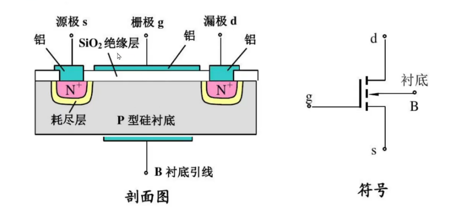
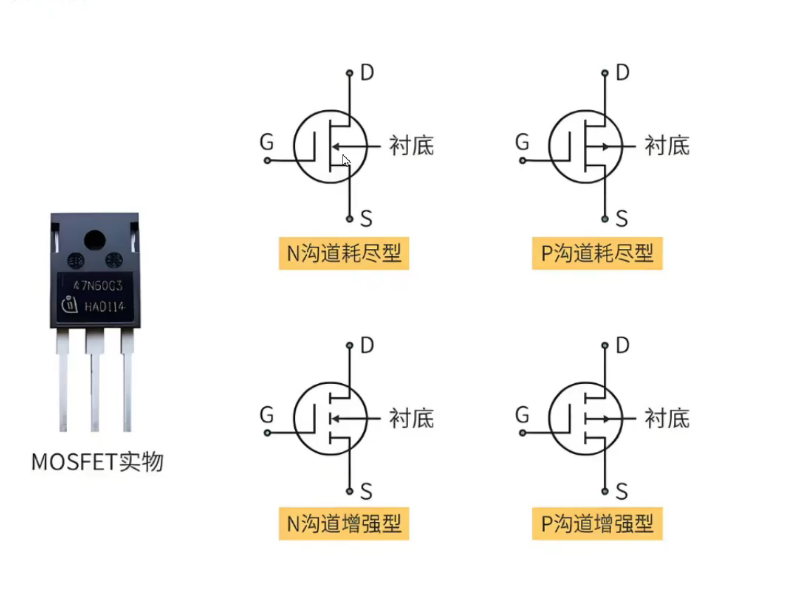
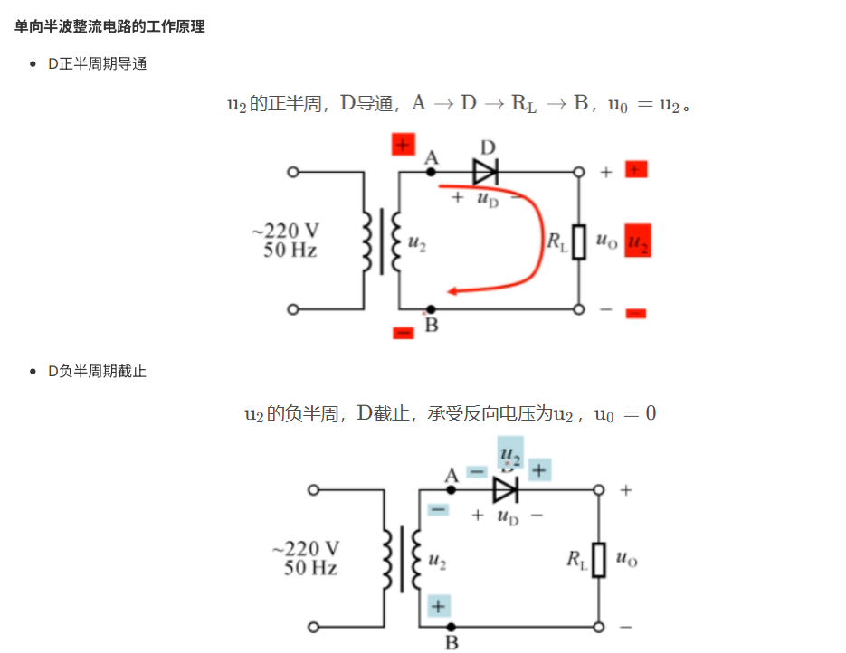

## 2.1 二极管
### 正向偏置下有低电阻--导通 反向偏置下有高电阻--截止
### 整流器 将交流信号转换成直流信号，向偏置下有低电阻；反向偏置下有高电阻
### 保护 防止反向电压或过电流损坏其他电子元件
### 信号调制和解调 例如调幅调制（AM）、调频调制（FM）
### 开关 控制电路通断
### 光电二极管 光信号转成电信号
### 稳压器 提供稳定的电压输出 例如肖特基二极管 稳压二极管
---

## 2.2 二极管分类
### **整流二极管** 电源电路
### **稳压二极管** 稳压器电路
### **发光二极管** 指示灯 OLED
### **光电二极管** 光电传感器 通信系统
---

## 2.3 三极管
### **集电极（C）** 提供电源
### **基极（B）** 调节电流大小
### **发射极（E）** 电流输出
---

### 三极管工作原理
#### PNP
##### C-->B
#### NPN 将弱信号放大成强信号 B-->C
---

### 三极管工作状态
#### **截止状态** 发射极反偏，集电极反偏；截止状态，各电极电流几乎为0，集电极和发射极互不相通
#### **放大状态** 发射极正偏，集电极反偏；ic=βib
#### **饱和状态** 发射极正偏，集电极正偏；电压降Uce=0.1V
---

### 三极管功能与应用
#### 放大功能 基极小电流控制集电极大电流
##### NPN Ie=Ic+Ib β=Ie/Ib
#### 开关功能 基极电流超过一定范围，导通；基极电流低于一定范围，截止
##### NPN导通条件
###### 1.基极加上一个高电平---导通
##### 2.基极加上一个低电平---截止
##### PNP导通条件
###### 1.基极加上一个高电平---截止
###### 2.基极加上一个低电平---导通
---

## 2.3 MOS管
### G：栅极
### S：源极
### D：漏极

### MOS管分类

### 工作原理
#### 控制源极和漏极之间的电压和电流，像一个开关，设备功能基于MOS电容
### 常用于控制系统、传感器、电源管理...

## 2.4 直流电源电路
### 能量转换电流 将220V/380V 50Hz交流电转换成直流电
### 整流电路

### 滤波电路
### 集成稳压器（三端稳压器）
#### 将输入端接整流滤波电路的输出，将输出端接负载电阻，构成串类型稳压电路
---
